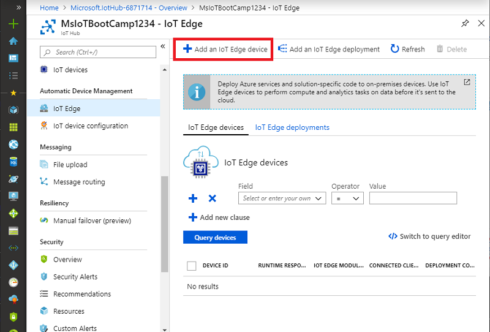

# Windows Server IoT 2019 + Azure IoT Edge (45 Min)

In many use cases, a Windows Server IoT 2019 can be used an IoT edge gateway that connects local devices and sensors to cloud services and apps. In this lab, we're going to walk you through how to turn a Windows Server IoT 2019 into an IoT edge gateway. We will use virtual machines in this lab, however, the same steps described in this article can be applied to a physical machine.  

In this lab you learn how to:

1. Create an IoT Hub
2. Create an IoT Edge device in your IoT hub
3. Install and start the IoT Edge runtime on a Windows Server IoT 2019
4. Deploy a module to a Windows Server IoT 2019 from Marketplace

## Prerequisites

- Azure Subscription  

  If you don't have an active Azure subscription, refer to [Lab 0](Lab0.md) to redeem your Azure pass, or create a [free account](https://azure.microsoft.com/free) before you begin
  
- Windows Server 2019, which can be a physical or virtual machine  

## Step 1 : Create an instance of IoT Hub

In this step, we will create an instance of Azure IoT Hub using [Azure Portal](https://portal.azure.com)

### Step 1.1 : Login to [Azure Portal](https://portal.azure.com)

Open a browser and navigate to [http://portal.azure.com](http://portal.azure.com), then follow sign in prompt to sign in to your Azure account

### Step 1.2 : Create an instance of Azure IoT Hub

Select **Create a resource** -> **Internet of Things** -> **IoT Hub**


### Step 1.3 : Create IoT Hub

There are 4 required parameters you must provide in order to create a new instance of IoT Hub.

| Data           | Description                              | Example                  |
| -------------- | ---------------------------------------- | ------------------------ |
| Subscription   | Subscription to use for the new IoT Hub  | Visual Studio Enterprise |
| Resource Group | Create a new Resource Group for this lab | IoTBootCamp2019          |
| Region         | Data center region nearest to you        | West US                  |
| IoT Hub Name   | Provide a name that is globally unique   | MsIoTBootCamp1234        |

1. Provide these information to create an instance of IoT Hub  
    Make sure to use your own Subscription, Resource Group Name, Region, and unique IoT Hub Name.
2. Confirm the uniqueness of IoT Hub name with green check mark.  
3. Click **Next: Size and scale>>**


### Step 1.4 : Select Size and Scale

IoT Hub support multiple scale and size, hence pricing.  Each tier has different quota.  It's important to select the right tier for your solution in real scenario to avoid hitting quotas.

For this lab, please select `F1: Free tier for Pricing and scale tier`, then click **Review + create**

> [!NOTE]  
> Only one `F1 (Free) tier` is available per subscription.  If you already have F1 Hub, you will not able to create 2nd free Hub.


Reference : [https://docs.microsoft.com/en-us/azure/iot-hub/iot-hub-scaling](https://docs.microsoft.com/en-us/azure/iot-hub/iot-hub-scaling)

### Step 1.5 : Start IoT Hub Deployment

Click **Create** button to start creating the new IoT Hub instance.  


### Step 1.6 : Wait for the Deployment process

Wait until your deployment completes.


> [!TIP]  
> You can also check deployment progress in `Notifications`  
>  
> 
>  
> You may want to **Pin to dashboard** for later use

## Step 2 : Register a new Azure IoT Edge device

In this step, we will create `Azure IoT Edge Device` for Windows Server IoT 2019

### Step 2.1 : Open the IoT Hub page

Go to the IoT Hub you just created by clicking `Go to resource` button


### Step 2.2 : Open IoT Edge View

Navigate to `IoT Edge` view


### Step 2.3 : Add an IoT Edge device

Add a new IoT Edge device for Windows Server IoT 2019

Click **Add an IoT Edge device**  



### Step 2.4 : Device ID

Device ID is used to identify the IoT Edge device (Windows Server IoT 2019).  

1. Provide a unique name  
  e.g. IoTBootCampServer2019-1

1. Click **Save** to create a new IoT Edge device


### Step 2.5 : Confirm the new IoT Edge device

Confirm the new IoT Edge device is created.

- If you do not see the new IoT Edge device, click **Refresh**
- Confirm the new IoT Edge device is listed


## Step 3 : Connection string

When you're ready to set up your physical device, you'll need a connection string which links your physical device with its identity in IoT hub.  

Device Connection String is used to authenticate to validate device identify so that only known/trusted devices can connect to your IoT Hub.

In this step, we will retrieve (Copy) the connection string for later use.

Reference : [https://devblogs.microsoft.com/iotdev/understand-different-connection-strings-in-azure-iot-hub/](https://devblogs.microsoft.com/iotdev/understand-different-connection-strings-in-azure-iot-hub/)

### Step 3.1 : Device details view

From the **IoT Edge** page in Azure Portal, click on the IoT Edge device to open **Device Details** page.

> [!TIP]  
> Two Connection Strings are available for every device


### Step 3.2 : Copy Connection String  

Copy the value of either **Connection string (primary key)** or **Connection string (secondary key)**

1. Click on **Copy button**  to copy into clipboard  
  
1. Paste and save to a text file for later use

## Step 4 : Connect to your Windows Server on a virtual machine

> [!IMPORTANT]  
> Instructors will provide Hostname and/or IP Address of Windows Server 2019 VM

Connect to Windows Server IoT 2019 to configure the connection to your IoT Hub.

In this lab, we will use Remote Desktop to configure Windows Server IoT 2019

### Windows Server IoT 2019 VM Credential

```bash  
User Name : iotbootcamp  
Password  : bootcamp  
```

### Step 4.1 : Open Remote Desktop Connection app

1. On the Windows 10 Dev machine, start **Remote Desktop Connection** app

> [!TIP]  
> you can type RDP from Window's search, then select then Remote Desktop Connection app

1. Enter Server Name or IP Address for your Server 2019
1. Click **Connect**
1. Login to your server using the credential mentioned [above](#windows-server-iot-2019-vm-credential)


## Step 5 : Set up IoT Edge Runtime

In this step, we will install (Deploy) and configure Azure IoT Edge Runtime to your Windows Server IoT 2019

### Step 5.1 : Open a Powershell as an Administrator

Please make sure to start Powershell as an **Administrator**


### Step 5.2 : Deploy IoT Edge Runtime

The cmdlet checks whether your Windows machine is on a supported version, turns on the containers feature, and then downloads the moby runtime and the IoT Edge runtime.  

Run the **Deploy-IoTEdge** powershell cmdlet

```powershell
. {Invoke-WebRequest -useb aka.ms/iotedge-win} | Invoke-Expression; Deploy-IoTEdge -ContainerOs Windows
```

### Step 5.3 : Initialize IoT Edge Runtime  

The cmdlet initializes the finish the IoT Edge installation.  For IoT Edge Runtime to initialize, it needs `Connection String` from [Step 3.2 : Copy Connection String](#step-32--copy-connection-string)

```powershell
. {Invoke-WebRequest -useb aka.ms/iotedge-win} | Invoke-Expression; Initialize-IoTEdge -ContainerOs Windows
```

### Step 5.4 : Provide the device connection string

Provide the connection string from [Step 3.2 : Copy Connection String](#step-32--copy-connection-string)

Example :


### Step 5.5 : Verify Azure IoT Edge Runtime Status

Run the Get-Service command to confirm IoT Edge runtime is installed and running

```powershell
Get-Service iotedge
```


## Step 6 : Deploy Simulated Temperature Sensor from Marketplace to Windows Server

IoT Edge is used to connect devices and sensors to cloud. In this lab, we're going to use an existing simulator from Azure Marketplace

Azure Marketplace is an online applications and services marketplace where you can browse through a wide range of enterprise applications and solutions that are certified and optimized to run on Azure, including [IoT Edge modules](https://azuremarketplace.microsoft.com/marketplace/apps/category/internet-of-things?page=1&subcategories=iot-edge-modules).

### Step 6.1 : Open Azure IoT Edge Market Place

From Azure portal, navigate to Marketplace or type Marketplace at the Search bar and select Marketplace


### Step 6.2 : Locate **Simulated Temperature Sensor**  

Within Marketplace, select **Get Started**, type in *simulated* at the search bar, then select **Simulated Temperature Sensor**


### Step 6.3 : Create Simulated Temperature Sensor module

Click **Create** to start the wizard


### Step 6.4 : Select the target IoT Edge device

In this step, you need to specify to which device, you would like to deploy the Simulated Temperature Sensor IoT Edge Module.

| Parameter            | Description                                                                                                    | Example                 |
| -------------------- | -------------------------------------------------------------------------------------------------------------- | ----------------------- |
| Subscription         | Select your subscription                                                                                       | MSNSubscription         |
| IoT Hub              | Select your IoT Hub to which the target device created in [the previous step](#step-24--device-id) is attached | MsIoTBootCamp1234       |
| IoT Edge Device Name | Select the target IoT Edge Device created in [the previous step](#step-24--device-id)                          | IoTBootCampServer2019-1 |

Click **Create** to move to the next step


### Step 6.5 : Add Modules

In some cases, you may need to provide additional parameters.  

Click **Next** with default settings


### Step 6.6 : Specify Routes

You may configure message route to/from IoT Edge modules.

All messages are routed to IoT Hub ($upstream) by default

```json
{
  "routes": {
    "route": "FROM /messages/* INTO $upstream",
    "upstream": "FROM /messages/* INTO $upstream"
  }
}
```

Click **Next** with default settings

Reference : [https://docs.microsoft.com/en-us/azure/iot-edge/module-composition#declare-routes](https://docs.microsoft.com/en-us/azure/iot-edge/module-composition#declare-routes)

### Step 6.7 : Submit deployment request

Click **Submit** to deploy the temperature simulator to the Windows Server


## Step 7 : Confirm Temperature Simulator Module Deployment  

 The simulated temperature sensor module generates environment data that you can use for testing later. The simulated sensor is monitoring both a machine and the environment around the machine. For example, this sensor might be in a server room, on a factory floor, or on a wind turbine. The message includes ambient temperature and humidity, machine temperature and pressure, and a timestamp

### Step 7.1 : Confirm the module is deployed and running

Confirm that the module deployed from the cloud is running on your IoT Edge device.

```powershell
iotedge list
```


### Step 7.2 : Confirm messages are being sent

View the messages being sent from the temperature sensor module to the cloud.

```powershell
iotedge logs SimulatedTemperatureSensor -f
```

   

### Step 7.3 : Confirm the messages are received by IoT Hub

In this step, we will use Device Explorer to view messages received by IoT Hub.

In order to access IoT Hub, you will need **Connection String** to your IoT Hub.  
This is different from **Connection String** for your IoT Edge device.  (Sometimes referred to as Device Connection String)

1. Start Device Explorer  
    > [!TIP]  
    > Open Device Explorer from the shortcut on your desktop  
  
    
1. **Shared Access Policies**  
    Open Shared Access Policies page in Azure Portal to retrieve **Connection String** for your IoT Hub  
1. View **iothubowner**  
    Open iothubowner to retrieve the connection string  
    
1. Copy Connection String  
    
1. Enter Connection String to Device Explorer
1. Click **Update**  
    
1. Open **Data** tab
1. Select Device ID of your Windows Server IoT 2019
1. Click **Monitor**
1. Confirm Messages are received  
    
