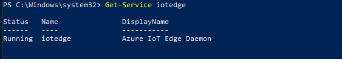

# Windows 10 IoT + Azure IoT Edge - Advance Lab (60 Min)

Visual Studio Code (VSCode) has become one of the premier development environments with many powerful tools to help developers accelerate the development process.  In this lab, we'll walk you through the process of developing an IoT Edge module and deploying the module to an IoT Edge device using VSCode. You will learn how to:

- Create Azure IoT Edge device id with VSCode
- Install and initialize Azure IoT Edge Runtime on Windows 10
- Create Azure Container Registry (ACR)
- Download and build Azure IoT Edge Module

## Prerequisites

- An instance of IoT Hub from the previous HOL
- .Net Core
    [https://dotnet.microsoft.com/download/thank-you/dotnet-sdk-2.2.107-windows-x64-installer](https://dotnet.microsoft.com/download/thank-you/dotnet-sdk-2.2.107-windows-x64-installer)

## Step 1: Register a new Azure IoT Edge device

In this lab, we will walk you through how to use Visual Studio Code Azure IoT Extension instead of Azure Portal Web site.

### Step 1.1 : Select IoT Hub

Using the Azure IoT extensions for Visual Studio Code to perform operations with your IoT hub. For these operations to work, you need to sign in to your Azure account and select the IoT hub that you are working on.

1. In Visual Studio Code, open the **Explorer** view.

1. At the bottom of the Explorer, expand the **Azure IoT Hub Devices** section.

1. Click **Select IoT Hub**.

1. Sign in to Azure account
    If you are not signed in to your Azure account, follow the prompts and sign in to your Azure account.

    

1. Select Subscription and IoT Hub
    Select your subscription and IoT Hub from the selection box on the top of VSCode window

    

## Step 2 : Create a device

In this step, you will create a new IoT Edge Device for your Windows 10 Dev Machine.

1. In the VS Code Explorer, move your mouse pointer on **AZURE IOT HUB** header

1. Click on the **...** to show PoP Up menu

1. Select **Create IoT Edge Device**

    

1. In the text box that opens, give your device an ID

    

1. Confirm the new IoT Edge device is seen in **AZURE IOT HUB**

    

In the **output** screen, you see the result of the command. The device info is printed, which includes the **deviceId** that you provided and the **Device Connection String** that you can use to connect your physical device to your IoT hub.

## Step 3 : Retrieve the device connection string

When you're ready to set up your device, you need the connection string that links your physical device with its identity in the IoT hub.

1. Right-click on the ID of your device in the **Azure IoT Hub Devices** section.

2. Select **Copy Device Connection String**

    

The connection string is copied to your clipboard.

You can also select **Get Device Info** from the right-click menu to see all the device info, including the connection string, in the output window.

## Step 4 : Install IoT Edge on Windows 10 Enterprise

In this step, we will install (Deploy) and initialize Azure IoT Edge Runtime to your Windows 10 Enterprise

> [!TIP]  
> In this instruction, we will use `iotedge` command.  If you are familiar with `docker` command, you need to specify host to connect to by specifying `-H npipe:////./pipe/iotedge_moby_engine` parameter.  
> E.g.  
>  
> ```ps
> docker -H npipe:////./pipe/iotedge_moby_engine ps
> ```

### Step 4.1 : Open a Powershell window as an Administrator

Please make sure to start Powershell as an **Administrator**


### Step 4.2 : Run the **Deploy-IoTEdge** command  

This command checks whether your Windows machine is on a supported version, turns on the containers feature, and then downloads the Moby runtime and the IoT Edge runtime

```powershell
. {Invoke-WebRequest -useb aka.ms/iotedge-win} | Invoke-Expression; Deploy-IoTEdge -ContainerOs Windows
```

Click Yes to the following pop-up questions. The machine will be restarted. After it's restarted, open a powershell window and run the command to finish the installation.

> [!NOTE]  
> This requires a reboot.  After reboot, restart admin Powershell and continue the rest of lab.

### Step 4.3 : Run the  Initialize-IoTEdge command to initialize the finish the IoT Edge installation

```powershell
. {Invoke-WebRequest -useb aka.ms/iotedge-win} | Invoke-Expression; Initialize-IoTEdge -ContainerOs Windows
```

### Step 4.4 : Provide the Device Connection String

Provide the device connection string (saved from [prior step](#step-3--retrieve-the-device-connection-string))

Example :


### Step 4.5 : Verify the connection

1. Check Service Status  
    Run the Get-Service command to confirm IoT Edge runtime is installed and the Azure IoT Edge Runtime ($edgeAgent) is running

    ```powershell
    Get-Service iotedge
    ```

    

1. List all modules running in IoT Edge  
    Azure IoT Edge Runtime module `edgeAgent` should be running

    ```powershell
    iotedge list
    ```

    

> [!TIP]  
> If you encounter issues, please check logs with `Get-IoTEdgeLog` cmdlet

## Step 5 : Create Azure Container Registry (ACR)

You need a container registry to push your app image to once the image is built. Once your image is available in a container registry, you will deploy directly from that registry.

### Step 5.1 : Create Azure Container Registry

1. Sign in to the [Azure Portal](https://portal.azure.com/)

1. Create **Container Registry**  
    **Create a resource** -> **Containers** -> **Container Registry**

    

### Step 5.2 : Set up ACR parameters

Enter values for Registry name and Resource group.  


|Parameter  |Description  |Example  |
|---------|---------|---------|
|Registry Name     | Unique name within Azure and 5-50 alphanumeric characters only | IoTBootCamp2019acr1         |
|Subscription     | Your subscription         |         |
|Resource Group     | Select the resource group used for your IoT Hub         | IoTBootCamp2019         |
|Location     | Select the same region as your IoT Hub         | West US         |
|Admin user     | This enables "User Name" and "Password" to access ACR.  Set to **Enable** | Enabled          |
|SKU     | Tier of ACR.  Different tier gives different storage size limit, etc.  Set to **Basic** for this lab         | Basic        |

When the **Deployment succeeded** message appears, select the container registry in the portal.

Reference :

- ACR Pricing : [https://azure.microsoft.com/en-us/pricing/details/container-registry/](https://azure.microsoft.com/en-us/pricing/details/container-registry/)

### Step 5.3 : Start ACR Deployment

Click **Create** and wait for deployment to finish  

> [!TIP]  
> You may want to **Pin to dashboard** for later use

### Step 5.4 : Login to your ACR

ACR is secure container registry, meaning you can control access to your registry.

Later in this lab, you will upload (push) your container image to your container registry.  In order to push your image, you need to be authenticated.

In this step, you will log in to your ACR using **Admin user** credential.

1. In VSCode, open Terminal  

    If `Terminal` window is not yet opened, open new terminal via **Terminal** menu -> **New Terminal**

    

1. Your ACR Access Key  
    In Azure Portal, open `Access Key` page of your ACR

    

1. Login to your ACR

    ```bash
    docker login <Your ACR Login Server Name> -u <Your ACR user name> -p <Your ACR password>
    ```
  
    Example :

    

References :

- ACR Authentication : [https://docs.microsoft.com/en-us/azure/container-registry/container-registry-authentication](https://docs.microsoft.com/en-us/azure/container-registry/container-registry-authentication)

## Step 6 : Prepare IoT Edge Module Sample

In this step, we will use sample code and run the module you build

- Download source code for `Simulated Temperature Sensor` from Github
- Compile and build binaries
- Upload to Azure Container Registry
- Deploy your container to Windows 10

Reference : [IoT Edge Samples](https://github.com/Azure/iotedge)

### Step 6.1 : Download Source Code

Download (or pull) source code for `Simulated Temperature Sensor` from Github with following commands

1. Open Console (CMD), Powershell, or VSCode terminal
1. Run git command
    Example : Clone to C:\Repo
  
    ```powershell  
    md c:\Repo
    cd C:\Repo
    git clone https://github.com/Azure/iotedge
    ```

    

### Step 6.2 : Build Sample

Using .Net Core SDK, build sample code.

> [!NOTE]  
> Make sure your have .Net Core SDK installed on your Windows 10 Dev Machine by running the following command  
>
> ```ps  
> PS C:\repo> dotnet --version  
> 2.2.204  
> PS C:\repo>  
> ```
>
> This command shows version number for .Net Core SDK

Reference : [https://dotnet.microsoft.com/download/thank-you/dotnet-sdk-2.2.107-windows-x64-installer](https://dotnet.microsoft.com/download/thank-you/dotnet-sdk-2.2.107-windows-x64-installer)

### Step 6.3 : Compile Simulated Temperature Sensor module

Before we containerize the module for Azure IoT Edge deployment, compile and run the sample locally without containerizing.

1. Navigate to `SimulatedTemperatureSensor` directory  
    Navigate to the directory containing source code for `SimulatedTemperatureSensor`  
    The source code is in `<SampleRoot>\edge-modules\SimulatedTemperatureSensor`

    E.g. : C:\repo\iotedge\edge-modules\SimulatedTemperatureSensor

    ```powershell
    PS C:\repo\iotedge\edge-modules\SimulatedTemperatureSensor> dir
  
        Directory: C:\repo\iotedge\edge-modules\SimulatedTemperatureSensor
  
    Mode                LastWriteTime         Length Name
    ----                -------------         ------ ----
    d-----        5/20/2019   8:01 PM                config
    d-----        5/20/2019   8:01 PM                docker
    d-----        5/20/2019   8:01 PM                src
    -a----        5/20/2019   8:01 PM           2958 SimulatedTemperatureSensor.csproj

    ```

1. Build Sample Code  
    Run dotnet command to build module

    ```ps
    dotnet publish -r win-x64
    ```

    This will generate binaries in `C:\repo\iotedge\edge-modules\SimulatedTemperatureSensor\bin\Debug\netcoreapp2.1\win-x64`  

    Example Output :
  
    ```powershell
    PS C:\repo> cd .\iotedge\edge-modules\SimulatedTemperatureSensor\
    PS C:\repo\iotedge\edge-modules\SimulatedTemperatureSensor> dotnet publish -r win-x64
    Microsoft (R) Build Engine version 16.0.450+ga8dc7f1d34 for .NET Core
    Copyright (C) Microsoft Corporation. All rights reserved.
  
      Restore completed in 6.21 sec for C:\repo\iotedge\edge-util\src\Microsoft.Azure.Devices.Edge.Util\Microsoft.Azure.Devices.Edge.Util.csproj.
      Restore completed in 8.48 sec for C:\repo\iotedge\edge-modules\SimulatedTemperatureSensor\SimulatedTemperatureSensor.csproj.
      Restore completed in 8.59 sec for C:\repo\iotedge\edge-modules\ModuleLib\Microsoft.Azure.Devices.Edge.ModuleUtil.csproj.
      Microsoft.Azure.Devices.Edge.Util -> C:\repo\iotedge\edge-util\src\Microsoft.Azure.Devices.Edge.Util\bin\Debug\netstandard2.0\Microsoft.Azure.Devices.Edge.Util.dll
      Microsoft.Azure.Devices.Edge.ModuleUtil -> C:\repo\iotedge\edge-modules\ModuleLib\bin\Debug\netcoreapp2.1\Microsoft.Azure.Devices.Edge.ModuleUtil.dll
      SimulatedTemperatureSensor -> C:\repo\iotedge\edge-modules\SimulatedTemperatureSensor\bin\Debug\netcoreapp2.1\win-x64\SimulatedTemperatureSensor.dll
      SimulatedTemperatureSensor -> C:\repo\iotedge\edge-modules\SimulatedTemperatureSensor\bin\Debug\netcoreapp2.1\win-x64\publish\
      ```

## Step 7: Containerize the Simulated Temperature Sensor

In order for an app to be run as an edge module, the app needs to be containerize first. In this section we're going to containerize the app.

When you containerize your app, you must consider the following points

1. Container Type
1. Container Image Name
1. Container Tag
1. Dockerfile  
    Dockerfile describes how to build container image

A container image name is made up of two parts.

### Container Type

There are two types of containers.  

- Linux container
- Windows Container

For this lab, we will use Windows container

### Container Image Name

Image name is made up of slash-separated names.  An image can be prefixed with registry host name, therefore, image name must comply with standard DNS rules.

Example : myazureregistry.azurecr.io/myimage

Rules :

- Lowercase letters
- Digits
- Separators (`.`, `_`, `-`)

### Container Tag

Tag is something for you to identify specific images.  Typically used with version numbers.

Rules :

- Valid ASCII characters (Upper and lower cases)
- Digits
- Underscores (`_`), Periods (`.`), and dashes (`-`)

### Step 7.1 : Container Type

We installed Azure IoT Edge Runtime for Windows Container in [Step 4 : Install IoT Edge on Windows 10](#step-4--install-iot-edge-on-windows-10).  

As a result, we must build **Windows Container** (vs. Linux Container).  

1. Open Docker for Desktop Setting  

    In Taskbar, look for `Docker Desktop` icon and right click to see Menu

    

1. Select **Switch to Windows containers...**  
  
    

1. Confirm Warning  

    
  
1. Wait for Docker Desktop to finish switching container type

### Step 7.2 : Containerize App

Run the following command to build container image

```ps
docker build .\bin\Debug\netcoreapp2.1\win-x64\publish -t <Tag> -f <Dockerfile>
```

Example with Image Name **SimulatedTemperatureSensor**

```ps
docker build .\bin\Debug\netcoreapp2.1\win-x64\publish -t simulatedtemperaturesensor -f .\docker\windows\amd64\Dockerfile
```

Confirm that you were able to build image with the following command

```ps
docker images
```

Example :

```ps
PS C:\repo\iotedge\edge-modules\SimulatedTemperatureSensor> docker images
REPOSITORY                              TAG                      IMAGE ID            CREATED             SIZE
simulatedtemperaturesensor              latest                   088860719e39        4 seconds ago       398MB
mcr.microsoft.com/dotnet/core/runtime   2.1.10-nanoserver-1809   d6a221ed7eed        4 weeks ago         321MB
```

### Step 7.3 : Tag your image

Run `docker tag` command to tag your image so you can push to your ACR

```ps
docker tag <Source Image>[:TAG] <Target Image>[:TAG]
```

Example : Using the image just built, tag them with **simtemp**:0.0.1

```ps
docker tag simulatedtemperaturesensor:latest iotbootcamp2019acr1.azurecr.io/simtemp:0.0.1
```

or you can also use Image ID (from output of `docker images` command)

```ps
docker tag 088860719e39 iotbootcamp2019acr1.azurecr.io/simtemp:0.0.1
```

### Step 7.4 : Push the image

Now image is built and tagged, the image is ready for upload (push)

Run `docker push` command to push to your acr

```ps
docker push <Your Tagged Image Name>
```

Example :

```ps
docker push iotbootcamp2019acr1.azurecr.io/simtemp:0.0.1
```

Example Output :

```ps
PS C:\repo\iotedge\edge-modules\SimulatedTemperatureSensor> docker push iotbootcamp2019acr1.azurecr.io/simtemp:0.0.1
The push refers to repository [iotbootcamp2019acr1.azurecr.io/simtemp]
da499279ea2b: Pushed
416b2cdadff0: Pushed
b366e64214b3: Pushed
f354c3635730: Pushed
146252efae6c: Pushed
6eaf1cf63dfc: Pushed
a2bb3d322957: Pushed
761ff3ef5aab: Pushed
5c3e3ab9e119: Pushed
273db4b66a2d: Skipped foreign layer
0.0.1: digest: sha256:ce4d56e9a062f7a77e8008d1e57eceda455555f8083194fec30fffc302c56598 size: 2507
```

### Step 7.5 : Confirm your image is pushed to your ACR

Check and verify the image is pushed to your ACR

1. Sign to [Azure Portal](https://portal.azure.com)
1. Navigate to your ACR resource
1. Open **Repositories** page  
1. Confirm your image is pushed with specified tag

Example with `simtemp` and tag `0.0.1`


## Step 8 : Deploy to your Windows 10

Now you prepared Azure IoT Edge module ready for the deployment to your Windows 10 device.

In order to deploy the image, you must prepare `Deployment Manifest`  

In this step, we will create a deployment manifest through Azure Portal  

### Step 8.1 : IoT Edge Details page

1. Sign to [Azure Portal](https://portal.azure.com)
1. Navigate to your IoT Edge Device ID  

    **IoT Hub** -> **IoT Edge** -> **Your Windows 10 Device ID**

    

    > [!NOTE]  
    > Runtime Response shows an error status at this point.  
    > This is because there is nothing deployed.  This is expected.

1. Open **Device details** and click **Set modules**

    

### Step 8.2 : Set Container Registry Settings

IoT Edge Runtime needs to pull images from your ACR, so set following information so IoT Edge Runtime can access ACR.  
Refer to [Step 5.4 : Login to your ACR](#step-54--login-to-your-acr)

|Parameter  |Description  |Example  |
|---------|---------|---------|
|Name     | Name of this setting | BootCampACR   |
|Address     | Your ACR Login Server Address        | iotbootcamp2019acr1.azurecr.io         |
|User Name   | Your ACR Admin User Name       | iotbootcamp2019acr1        |
|Password     | Your ACR Password        |         |


### Step 8.3 : Add Module

The next step is specifying a module to deploy.

1. Click **+Add**
1. Select **IoT Edge Module**
1. Give a name for this module  
    This is the name used by Azure IoT Edege (vs. Module name)
1. Provide Image URL  
    The full image path you pushed to your ACR
1. Click **Save**
1. Click **Next**


### Step 8.4 : Specify Routes

Similar to the previous HOL, the module will upload all messages to IoT Hub.

Take default route setting and click **Next**

### Step 8.5 : Review and Submit

The contents displayed in **Review Deployment** page is `Deployment Manifest`.  
You may copy the contents and share with others so your teammates can deploy your module, for example.

> [!WARNING]  
> Deployment Manifest contains credential to your ACR.

Review the settings and click **Submit**

### Step 8.6 : Monitor deployment progress

Deployment may take a few minutes.  You can check deployment progress by monitoring logs from **edgeAgent**.

Edge Agent is one of Azure IoT Edge Runtime responsible for communicating with Azure and module deployment.

Run `iotedge logs` command to monitor deployment progress

```ps
iotedge logs -f edgeAgent
```

Enter `Ctrl + c` to exit from log monitoring, then check with `iotedge list` command to see the list of modules and their status

Example :

```ps
PS C:\repo\iotedge\edge-modules\SimulatedTemperatureSensor> iotedge logs -f edgeAgent
[06/09/2019 03:32:14.668 PM] Edge Agent Main()
2019-06-09 08:32:14.900 -07:00 [INF] - Starting module management agent.
2019-06-09 08:32:15.077 -07:00 [INF] - Version - 1.0.7.1.22377503 (f7c51d92be8336bc6be042e1f1f2505ba01679f3)
2019-06-09 08:32:15.078 -07:00 [INF] -
        █████╗ ███████╗██╗   ██╗██████╗ ███████╗
       ██╔══██╗╚══███╔╝██║   ██║██╔══██╗██╔════╝
       ███████║  ███╔╝ ██║   ██║██████╔╝█████╗
       ██╔══██║ ███╔╝  ██║   ██║██╔══██╗██╔══╝
       ██║  ██║███████╗╚██████╔╝██║  ██║███████╗
       ╚═╝  ╚═╝╚══════╝ ╚═════╝ ╚═╝  ╚═╝╚══════╝

 ██╗ ██████╗ ████████╗    ███████╗██████╗  ██████╗ ███████╗
 ██║██╔═══██╗╚══██╔══╝    ██╔════╝██╔══██╗██╔════╝ ██╔════╝
 ██║██║   ██║   ██║       █████╗  ██║  ██║██║  ███╗█████╗
 ██║██║   ██║   ██║       ██╔══╝  ██║  ██║██║   ██║██╔══╝
 ██║╚██████╔╝   ██║       ███████╗██████╔╝╚██████╔╝███████╗
 ╚═╝ ╚═════╝    ╚═╝       ╚══════╝╚═════╝  ╚═════╝ ╚══════╝

2019-06-09 08:32:15.200 -07:00 [INF] - Started operation refresh twin config
2019-06-09 08:32:15.226 -07:00 [INF] - Edge agent attempting to connect to IoT Hub via Amqp_Tcp_Only...
2019-06-09 08:32:15.822 -07:00 [INF] - Created persistent store at C:\Windows\TEMP\edgeAgent
2019-06-09 08:32:16.326 -07:00 [INF] - Edge agent connected to IoT Hub via Amqp_Tcp_Only.
2019-06-09 08:32:16.693 -07:00 [INF] - Obtained Edge agent twin from IoTHub with desired properties version 2 and reported properties version 4.
2019-06-09 08:32:17.398 -07:00 [INF] - Plan execution started for deployment 2
2019-06-09 08:32:17.432 -07:00 [INF] - Executing command: "Command Group: (
  [Create module mysimtempsensor]
  [Start module mysimtempsensor]
)"
2019-06-09 08:32:17.434 -07:00 [INF] - Executing command: "Create module mysimtempsensor"
2019-06-09 08:32:47.091 -07:00 [INF] - Executing command: "Start module mysimtempsensor"
2019-06-09 08:32:48.152 -07:00 [INF] - Executing command: "Command Group: (
  [Create module edgeHub]
  [Start module edgeHub]
)"
2019-06-09 08:32:48.152 -07:00 [INF] - Executing command: "Create module edgeHub"
2019-06-09 08:32:56.393 -07:00 [INF] - Executing command: "Start module edgeHub"
2019-06-09 08:32:57.177 -07:00 [INF] - Plan execution ended for deployment 2
2019-06-09 08:32:57.513 -07:00 [INF] - Updated reported properties
2019-06-09 08:33:02.740 -07:00 [INF] - Updated reported properties

PS C:\repo\iotedge\edge-modules\SimulatedTemperatureSensor> iotedge list
NAME             STATUS           DESCRIPTION      CONFIG
edgeAgent        running          Up 4 minutes     mcr.microsoft.com/azureiotedge-agent:1.0
edgeHub          running          Up 3 minutes     mcr.microsoft.com/azureiotedge-hub:1.0
mysimtempsensor  running          Up 3 minutes     iotbootcamp2019acr1.azurecr.io/simtemp:0.0.1
```

## Step 9 : Verify Your Module

Please follow the same procedure in the [previous lab](Day1-HOL1.md#step-7--confirm-temperature-simulator-module-deployment) to confirm your module is deployed and running as expected.

- Run `iotedge list` command to confirm the module is deployed and running
- Run `iotedge logs -f <You Module Name>` to see logs from your module
- Run `Device Explorer` to see logs are sent to your IoT Hub

## Step 10 : Clean up

To uninstall Azure IoT Edge, run `uninstall-edge -force` command

Reference : [https://docs.microsoft.com/en-us/azure/iot-edge/how-to-install-iot-edge-windows#all-installation-parameters](https://docs.microsoft.com/en-us/azure/iot-edge/how-to-install-iot-edge-windows#all-installation-parameters)

## Step 11 : Optional Challenger Step

Deploy IoT Edge with Device Provisioning Service (DPS).

### Step 11.1 : Create DPS instance

Follow steps described [here](https://docs.microsoft.com/en-us/azure/iot-dps/quick-setup-auto-provision#create-a-new-instance-for-the-iot-hub-device-provisioning-service) and [here](https://docs.microsoft.com/en-us/azure/iot-dps/quick-setup-auto-provision#link-the-iot-hub-and-your-device-provisioning-service) to create a new instance of DPS

References :

- [https://docs.microsoft.com/en-us/azure/iot-dps/quick-setup-auto-provision#create-a-new-instance-for-the-iot-hub-device-provisioning-service](https://docs.microsoft.com/en-us/azure/iot-dps/quick-setup-auto-provision#create-a-new-instance-for-the-iot-hub-device-provisioning-service)
- [https://docs.microsoft.com/en-us/azure/iot-dps/quick-setup-auto-provision#link-the-iot-hub-and-your-device-provisioning-service](https://docs.microsoft.com/en-us/azure/iot-dps/quick-setup-auto-provision#link-the-iot-hub-and-your-device-provisioning-service)

### Step 11.2 : Install IoT Edge Runtime with DPS

Follow steps described [here](https://docs.microsoft.com/en-us/azure/iot-dps/quick-setup-auto-provision#link-the-iot-hub-and-your-device-provisioning-service) to install IoT Edge Runtime with DPS

Reference :

- [https://docs.microsoft.com/en-us/azure/iot-dps/quick-setup-auto-provision#link-the-iot-hub-and-your-device-provisioning-service](https://docs.microsoft.com/en-us/azure/iot-dps/quick-setup-auto-provision#link-the-iot-hub-and-your-device-provisioning-service)