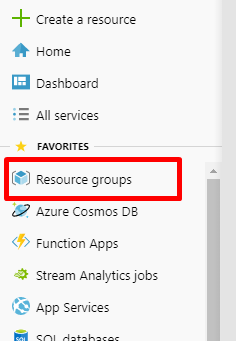

# Introduction to Azure IoT Hub and Connect MXChip


Azure IoT Hub is a fully managed service that enables reliable and secure bidirectional communications between millions of IoT devices and a solution back end.

## In this lab you will

* Learn to Create IoT Hub

* Learn to setup MXChip, connect to IoT Hub and send data

## Create Resource Group

Create a resource group to collect and manage all your application resources for this lab



Click on **+ Add** button


Enter **Resource group name**,  Select **subscription** and **region**. Click on **Review + Create**, and after reviewing, click on **Create**.

> [!NOTE]  
> Resource Group Name : Use name of your choice.  E.g. BootCampFy19  
> Region : Use one nearest for you.  E.g. West US


## Create IoThub

Click on **Create a resource** and click on **Internet of Things**. Then click on **IoTHub**.


Make sure you select the resource group you created in previous step.

In the Name field, enter a unique name for your IoT hub.

> [!NOTE]  
> IoT Hub Name : The name of your IoT hub must be **unique** across all IoT hubs.

Click on **Review + Create**, and after reviewing, click on **Create**.


## Register a device

Click on **IoT devices** and **+ Add**.


Give your device a descriptive **Device ID** and click **Save**.

> [!NOTE]  
> Device ID : Give a name of your choice.  E.g. mxchip


Select your device and copy the connection string. Save the connection string to use later in the lab.


## Connect MXChip Device


You can use the [MXChip IoT DevKit](https://microsoft.github.io/azure-iot-developer-kit/) to develop and prototype Internet of Things (IoT) solutions that take advantage of Microsoft Azure services. It includes an Arduino-compatible board with rich peripherals and sensors, an open-source board package, and a growing [projects catalog](https://microsoft.github.io/azure-iot-developer-kit/docs/projects/).

### Prepare your hardware

Hook up the following hardware to your computer:

* DevKit board
* Micro-USB cable

  

To connect the DevKit to your computer, follow these steps:

1. Connect the USB end to your computer.

2. Connect the Micro-USB end to the DevKit.

3. The green LED for power confirms the connection.

   

## Updating MxChip Firmware

Locate a storage device mounted to your PC.  The volume name is `AZ3166`


Download [the latest firmware](https://aka.ms/devkit/prod/getstarted/latest), and save or copy/paste the BIN file to `AZ3166` drive.

The DevKit will automatically reboot to complete FW update process.

## Configure Wi-Fi

IoT projects rely on internet connectivity. Use the following instructions to configure the DevKit to connect to Wi-Fi.

### Enter AP mode

Hold down button B, push and release the reset button, and then release button B.

Your DevKit enters AP mode for configuring Wi-Fi. The screen displays the service set identifier (SSID) of the DevKit and the configuration portal IP address.


### Connect to DevKit AP

Now, use another Wi-Fi enabled device (computer or mobile phone) to connect to the DevKit SSID (highlighted in the previous image). Leave the password empty.


### Configure Wi-Fi for the DevKit

Open **[192.168.0.1](http://192.168.0.1)** in the browser. Select the Wi-Fi that you want the IoT DevKit connect to, type the Wi-Fi password, then paste the device connection string you made note of previously. Then click **Save**.


> [!NOTE]  
> Microsoft Ready SSID  
> SSID : MSFTWIFI  
> Password : Microsoft

When the connection succeeds, the DevKit reboots in a few seconds. You then see the Wi-Fi name and IP address on the screen.

> [!NOTE]
> You will need a 2.4GHz network for IoT DevKit to work. The WiFi module on the IoT DevKit is not compatible with 5GHz network. Check [FAQ](https://microsoft.github.io/azure-iot-developer-kit/docs/faq/#wi-fi-configuration) for more details.

After Wi-Fi is configured, your credentials will persist on the device for that connection, even if the device is unplugged. For example, if you configure the DevKit for Wi-Fi in your home and then take the DevKit to the office, you will need to reconfigure AP mode (starting at the step in the "Enter AP Mode" section) to connect the DevKit to your office Wi-Fi.

## Start using the DevKit

## Prepare the development environment

### Download Arduino IDE

Download the Arduino IDE from <https://www.arduino.cc/en/Main/Software>.
If you're on Windows make sure to **not** go for the "Windows App", and instead install via the good ol' installer.

### Install ST-Link drivers

If you are running Windows: Download USB driver [from STMicroelectronics website](https://www.st.com/en/development-tools/stsw-link009.html), unzip, and install it by running  `dpinst_amd64.exe` on 64-bit machines, `dpinst_x86.exe` on 32-bit machines.

### Configure Azure IoT Tools

> [!NOTE]  
> VSCode extensions are pre-installed to your lab machine.  This is for your reference in case you would like to build your own development environment

Follow these steps to prepare the development environment for DevKit:

1. *If the Arduino extension is already installed, you can skip this step.* Launch VS Code, look for **Arduino** in the extension marketplace and install it. This extension provides enhanced experiences for developing on Arduino platform.

    

1. *If the Azure IoT Tools extension is already installed, you can skip this step.* Look for **Azure IoT Tools** in the extension marketplace and install it.

    

1. Configure VS Code with Arduino settings.

    In Visual Studio Code, click `F1` to open the command palette. Then click search for and select **"Open Settings (JSON)"** to open the **settings.json** file.
    

    Add following lines to configure Arduino depending on your platform:

    ```json
    "arduino.path": "C:\\Program Files (x86)\\Arduino",
    "arduino.additionalUrls": "https://raw.githubusercontent.com/VSChina/azureiotdevkit_tools/master/package_azureboard_index.json"
    ```

    > [!IMPORTANT]  
    > Make sure you add **,** to the end of 4th line  

    

1. Click `F1` to open the command palette, type and select **Arduino: Board Manager**. Search for **AZ3166** and install the latest version.

    

Now you are all set with preparing and configuring your development environment. Let us build the “Hello World” sample for IoT: sending temperature telemetry data to Azure IoT Hub.

## Build your first project

### Open sample code from sample gallery

1. Make sure your IoT DevKit is **not connected** to your computer. Start VS Code first, and then connect the DevKit to your computer.

2. Click `F1` to open the command palette, type and select **Azure IoT Device Workbench: Open Examples...**. Then select **IoT DevKit** as board.

3. In the IoT Workbench Examples page, find **Get Started** and click **Open Sample**. Then selects the default path to download the sample code.
    

### Select IoT Hub and device

In the new opened project window, click `F1` to open the command palette, type and select **Azure IoT Device Workbench: Provision Azure Services...**. Follow the step by step guide to select your Azure IoT Hub and IoT Hub device.

### Configure and compile device code

1. In the bottom-right status bar, check the **MXCHIP AZ3166** is shown as selected board and serial port with **STMicroelectronics** is used.
    

2. Click `F1` to open the command palette, type and select **Azure IoT Device Workbench: Configure Device Settings...**, then select **Config Device Connection String > Select IoT Hub Device Connection String**.

3. On DevKit, hold down **button A**, push and release the **reset** button, and then release **button A**. Your DevKit enters configuration mode and saves the connection string.
    

4. Click `F1` again, type and select **Azure IoT Device Workbench: Upload Device Code**. It starts compile and upload the code to DevKit.
    

The DevKit reboots and starts running the code.

> [!NOTE]
> If there is any errors or interruptions, you can always recover by running the command again.

## Test the project

### View the telemetry sent to Azure IoT Hub

Click the power plug icon on the status bar to open the Serial Monitor:


The sample application is running successfully when you see the following results:

* The Serial Monitor displays the message sent to the IoT Hub.
* The LED on the MXChip IoT DevKit is blinking.


### View the telemetry received by Azure IoT Hub

You can use [Azure IoT Tools](https://marketplace.visualstudio.com/items?itemName=vsciot-vscode.azure-iot-tools) to monitor device-to-cloud (D2C) messages in IoT Hub.

1. Sign in [Azure portal](https://portal.azure.com/), find the IoT Hub you created.
    

1. In the **Shared access policies** pane, click the **iothubowner policy**, and write down the Connection string of your IoT hub.
    

1. In VS Code, click `F1`, type and select **Azure IoT Hub: Set IoT Hub Connection String**. Copy the connection string into it.
    

1. Expand the **AZURE IOT HUB DEVICES** pane on the right, right click on the device name you created and select **Start Monitoring Built-in Event Endpoint**.

2. In **OUTPUT** pane, you can see the incoming D2C messages to the IoT Hub.
    

## Finished!

You have successfully connected an MXChip IoT DevKit to your IoT hub, and you have sent the captured sensor data to your IoT hub.

## Optional Challenger Lab

### How to save your telemetry data to a Cold storage?

>[!Tip]
>1. Create an AZure Storage Account
>2. Add an Endpoint to your IoT Hub which links to your created Azure Storage Account
>3. Add a Route to your IoT Hub to save telemetry data to your new Endpoint

References:
- <https://docs.microsoft.com/en-us/azure/storage/common/storage-quickstart-create-account?tabs=azure-portal>

- https://docs.microsoft.com/en-us/azure/iot-hub/iot-hub-devguide-messages-d2c
