# Visualize Time Series Data with Azure Time Series Insights

In this lab you will learn how to

* set up a Time Series Insights environment
* explore and analyze time series data of your IoT solutions or connected things
Click on **Create a Resource** and click on **Internet of Things**

Click on **Time Series Insights**

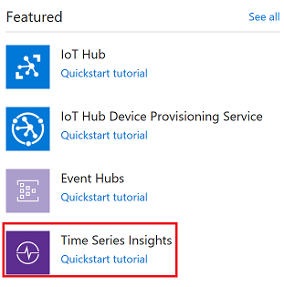

Select the resource group you previously created, and fill in the other parameters. Then click **Next: Event Source**.

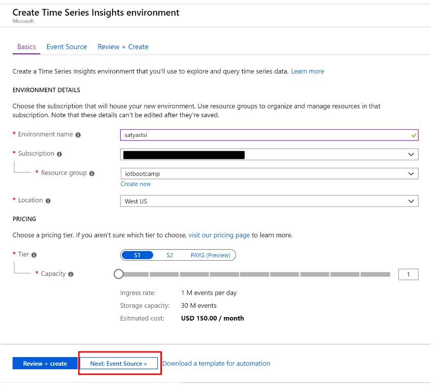

Click **New** to add an IoT Hub Consumer Group with a descriptive name, for example **"timeseriesinsightsevents"**. Then click **Review + create**. After reviewing, click **Create**.

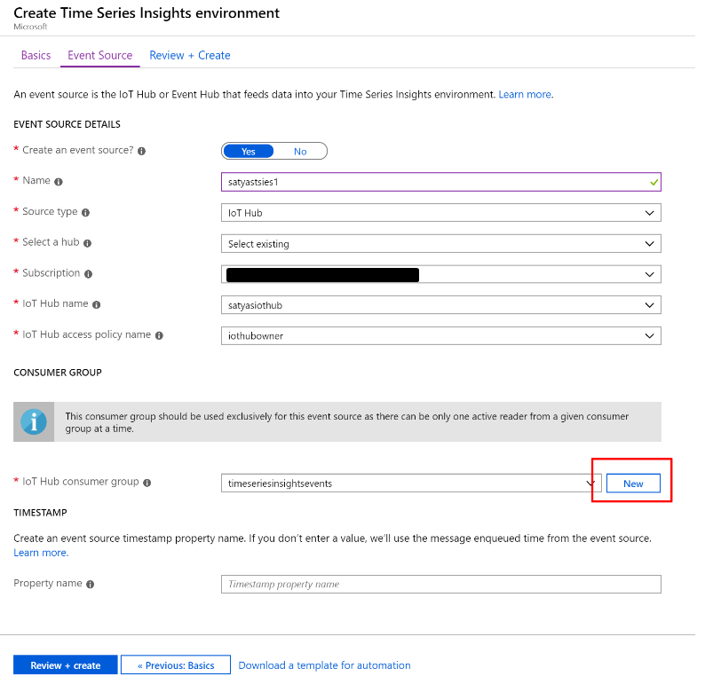

### Setup Time Series Insights

Go To Time Series Insights, Click on Go To Environment which will take you to Time Series Insights Explorer

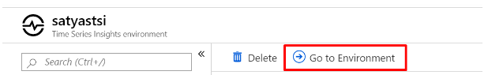

If you get a Data Access Policy Error execute the following steps.

Go To Data Access Policies

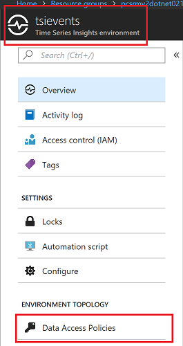

Click on Add Button

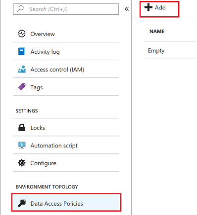

Select Contributor Role

Select User

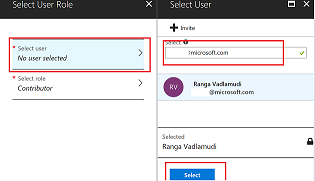

### Time Series Insights Explorer

Go To Time Series Insights Explorer

Select humidity. You will see data flowing from your MXChip device. 

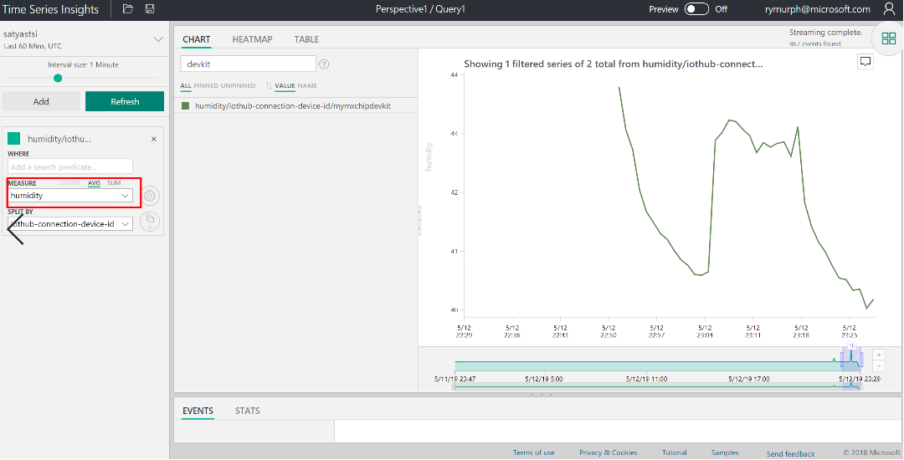

Right Click to Explore events. You can download events in CSV and JSON format by clicking on **CSV or JSON** buttons

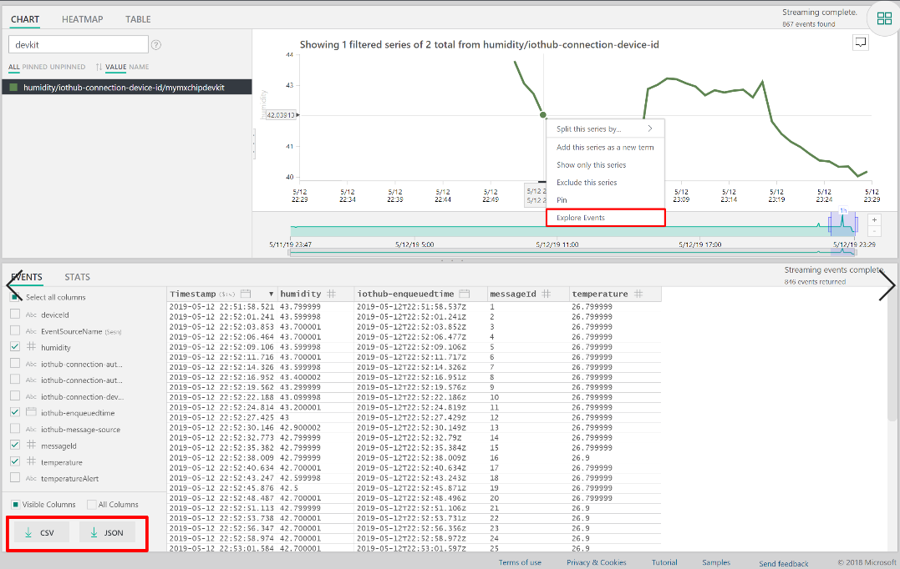

Create a perspective by clicking on the image shown below

Click **+** to add a new query

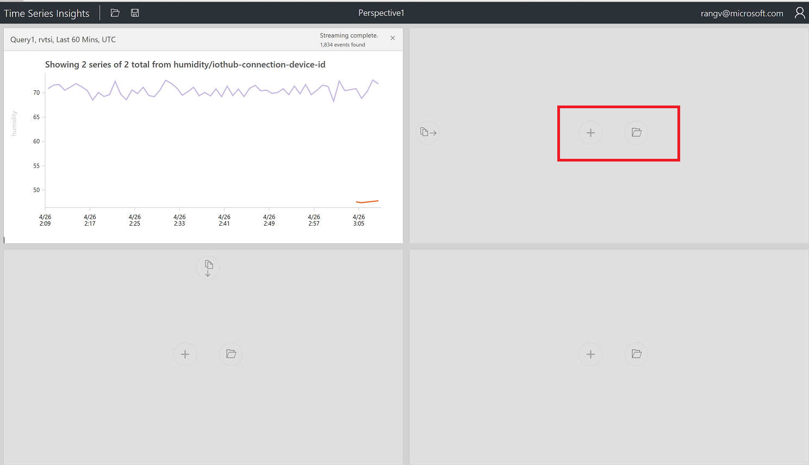

Create a chart by selecting a timeframe with drag feature

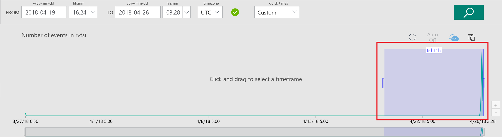

This time set the **Measure** to **Temperature**. Click on perspective image.

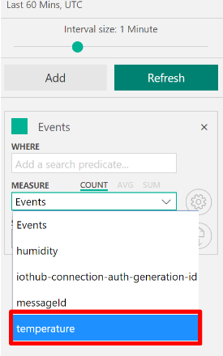

Click on Heatmap and save as another chart.

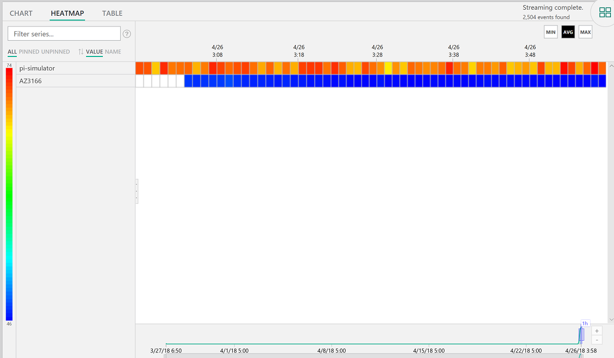

Perspective with 4 different charts and custom Title

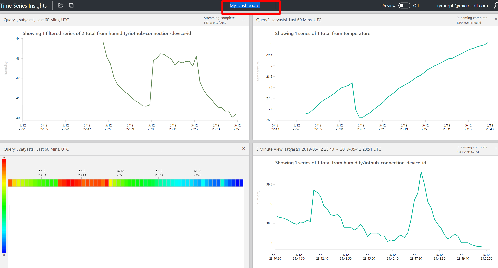

View data in a table. If you have multiple devices, they will appear as separate rows in the table as below.

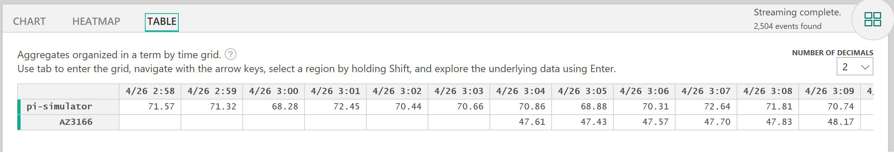

## Finished!

You have successfully set up Azure Time Series Insights and analyzed your device's time series data.

## Optional Chellenger Lab 

### How to Incorporate Time Series Insight Data into Your Own App? 

>[!Tip]
> - TSI data can be accessed via REST API
> - Leverage Azure AD to grant permissions to TSI API

Reference: 
- <https://docs.microsoft.com/en-us/azure/time-series-insights/tutorial-create-tsi-sample-spa>
- <https://docs.microsoft.com/en-us/rest/api/time-series-insights/ga-query-api>
