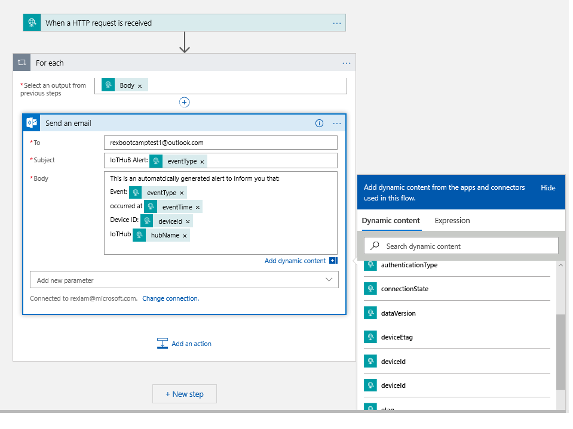

# Capture Device Events and Send Notifications

Azure Event Grid enables you to react to events in IoT Hub by triggering actions in your downstream business applications.

This article walks through a sample configuration that uses IoT Hub and Event grid. By the end, you will have an Azure logic app set up to send a notification email every time a device is added to your IoT hub. 

## Prerequisites

* An email account from any email provider that is supported by Azure Logic Apps, like Office 365 Outlook, Outlook.com, or Gmail. This email account is used to send the event notifications. For a complete list of supported Logic App connectors, see the [Connectors overview](https://docs.microsoft.com/connectors/)
* An active Azure account. If you don't have one, you can [create a free account](https://azure.microsoft.com/pricing/free-trial/).
* An IoT Hub in Azure. If you haven't created one yet, please refer to Day 2 Lab 1, or [Get started with IoT Hub](../iot-hub/iot-hub-csharp-csharp-getstarted.md) to create one. 

## Create a logic app

First, create a logic app and add an Event grid trigger that monitors the resource group for your virtual machine. 

### Create a logic app resource

1. In the [Azure portal](https://portal.azure.com), select **Create a resource** > **Integration** > **Logic App**.

   

2. Click Add to create a new Logic App  
3. Give your logic app a name that's unique in your subscription, then select the same subscription, resource group, and location as your IoT hub. 
4. Select **Create**.
   
   

5. Once the resource is created, navigate to your logic app. 
  Hint: Use the Search box on the top to help locate your resource. For instance you can type your LogicApp name in the Serach box.

6. The Logic Apps Designer shows you templates for common patterns so you can get started faster. In the Logic App Designer under **Templates**, choose **Blank Logic App** so that you can build your logic app from scratch.

   

### Select a trigger

A trigger is a specific event that starts your logic app. For this tutorial, the trigger that sets off the workflow is receiving a request over HTTP.  

1. In the connectors and triggers search bar, type **HTTP**.
2. Select **Request - When an HTTP request is received** as the trigger. 

   

3. Select **Use sample payload to generate schema**. 

   

4. Paste the following sample JSON code into the text box, then select **Done**:

   ```json
   [{
     "id": "56afc886-767b-d359-d59e-0da7877166b2",
     "topic": "/SUBSCRIPTIONS/<subscription ID>/RESOURCEGROUPS/<resource group name>/PROVIDERS/MICROSOFT.DEVICES/IOTHUBS/<hub name>",
     "subject": "devices/LogicAppTestDevice",
     "eventType": "Microsoft.Devices.DeviceCreated",
     "eventTime": "2018-01-02T19:17:44.4383997Z",
     "data": {
       "twin": {
         "deviceId": "LogicAppTestDevice",
         "etag": "AAAAAAAAAAE=",
         "deviceEtag": "null",
         "status": "enabled",
         "statusUpdateTime": "0001-01-01T00:00:00",
         "connectionState": "Disconnected",
         "lastActivityTime": "0001-01-01T00:00:00",
         "cloudToDeviceMessageCount": 0,
         "authenticationType": "sas",
         "x509Thumbprint": {
           "primaryThumbprint": null,
           "secondaryThumbprint": null
         },
         "version": 2,
         "properties": {
           "desired": {
             "$metadata": {
               "$lastUpdated": "2018-01-02T19:17:44.4383997Z"
             },
             "$version": 1
           },
           "reported": {
             "$metadata": {
               "$lastUpdated": "2018-01-02T19:17:44.4383997Z"
             },
             "$version": 1
           }
         }
       },
       "hubName": "egtesthub1",
       "deviceId": "LogicAppTestDevice"
     },
     "dataVersion": "1",
     "metadataVersion": "1"
   }]
   ```

5. You may receive a pop-up notification that says, **Remember to include a Content-Type header set to application/json in your request.** You can just click Got It, and move on to the next step. 

### Create an action

Actions are any steps that occur after the trigger starts the logic app workflow. For this tutorial, the action is to send an email notification from your email provider. 

1. Select **New step**. This will open a window to **Choose an action**.

2. Search for **Email**.

3. Based on your email provider, find and select the matching connector. This tutorial uses **Office 365 Outlook**. The steps for other email providers are similar. 

   

4. Scroll down the list of Actions, and select the **Send an email** action.
   
  

5. If prompted, sign in to your email account. 

6. Build your email template. 
   * **To**: Enter the email address to receive the notification emails. For this tutorial, use an email account that you can access for testing. 
  
   Note: If you need a test email account, please feel free to create one at http://outlook.com
  
   * **Subject** and **Body**: Write the text for your email. 
    
   * Notice the selection tool on the right hand side, which provides a list of dynamic content (generated from sample event data) that can be included into to your email.  

   Your email template may look like this example:

   

7. Save your logic app. 

### Copy the HTTP URL

Before you leave the Logic Apps Designer, copy the URL that your logic apps is listening to for a trigger. You use this URL to configure Event Grid. 

1. Expand the **When a HTTP request is received** trigger configuration box by clicking on it. 
2. Copy the value of **HTTP POST URL** by selecting the copy button next to it. 

   

3. Save this URL so that you can refer to it in the next section. 

## Configure subscription for IoT Hub events

In this section, you configure your IoT Hub to publish events as they occur. 

1. In the Azure portal, navigate to your IoT hub. 
2. Select **Events**.

   

3. Select **Event subscription**. 

   

4. Create the event subscription with the following values: 
   * **Event Type**: Uncheck Subscribe to all event types and select **Device Created** from the menu.

    
   * **Endpoint Details**: Select Endpoint Type as **Web Hook** and click on select endpoint and paste the URL that you copied from your logic app and confirm selection.

     

   * **Event Subscription Details**: Provide a descriptive name and select **Event Grid Schema**

   When you're done, the form should look like the following example: 

    

5. You could save the event subscription here, and receive notifications for every device that is created and deleted in your IoT hub. 
6. Select **Create** to save the event subscription.

## Create a new device

Test your logic app by creating a new device to trigger an event notification email. 

1. From your IoT hub, select **IoT Devices**, then select **Add**.
 
   
2. For **Device ID**, enter `TestDevice123`. Use the default values for the other fields. 
3. Select **Save**.

4. Check your email. You should receive an email trigger by logic app.

  

5. Similarly, if you deleted a device from IoTHub, an event would be generated, which would in turn trigger logic app to send you an email notification. 
   
