# Device Provisioning Service

In this lab, you learn how to:

* Configure the global endpoint of the Device Provisioning service on a device.
* Use a unique device secret (UDS) to generate an X.509 certificate.
* Enroll an individual device.
* Verify that the device is registered.

## Create a new instance for the IoT Hub Device Provisioning Service

1. Click the **Create a resource** button found on the upper left-hand corner of the Azure portal.

2. *Search the Marketplace* for the **Device provisioning service**. Select **IoT Hub Device Provisioning Service** and click the **Create** button. 

3. Provide the following information for your new Device Provisioning service instance and click **Create**.

    * **Name:** Provide a unique name for your new Device Provisioning service instance. If the name you enter is available, a green check mark appears.
    * **Subscription:** Choose the subscription that you want to use to create this Device Provisioning service instance.
    * **Resource group:** Choose the same resource group that contains the Iot hub you created above.
    * **Location:** Select the closest location to your devices.

      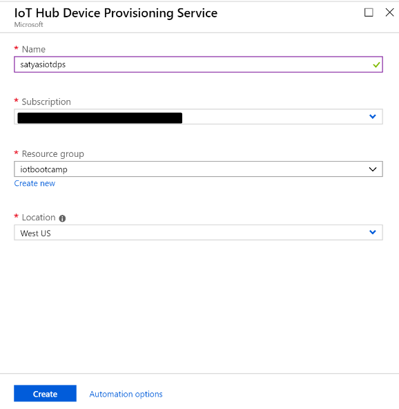  

4. Click the notification button to monitor the creation of the resource instance. Once the service is successfully deployed, click **Pin to dashboard**, and then **Go to resource**.

    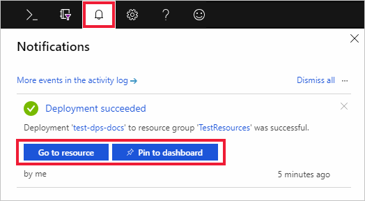

## Link the IoT hub and your Device Provisioning service

In this section, you will add a configuration to the Device Provisioning service instance. This configuration sets the IoT hub for which devices will be provisioned.

1. Click the **All resources** button from the left-hand menu of the Azure portal. Select the Device Provisioning service instance that you created in the preceding section.  

2. On the Device Provisioning Service summary blade, select **Linked IoT hubs**. Click the **+ Add** button seen at the top. 

3. On the **Add link to IoT hub** page, provide the following information to link your new Device Provisioning service instance to an IoT hub. Then click  **Save**. 

    * **Subscription:** Select the subscription containing the IoT hub that you want to link with your new Device Provisioning service instance.
    * **Iot hub:** Select the IoT hub to link with your new Device Provisioning service instance.
    * **Access Policy:** Select **iothubowner** as the credentials for establishing the link with the IoT hub.  

      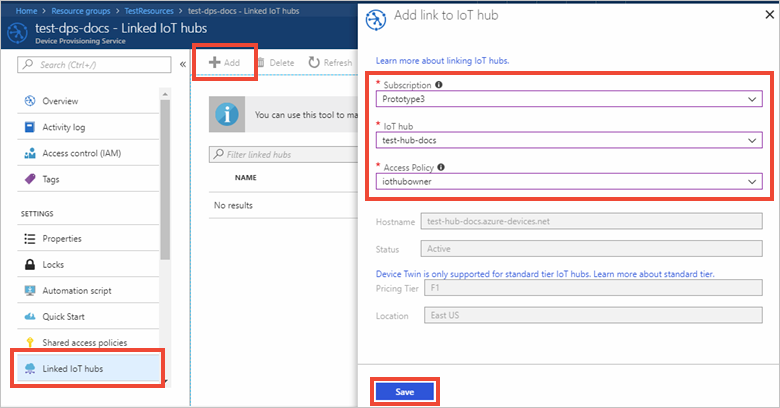  

3. Now you should see the selected hub under the **Linked IoT hubs** blade. You might need to click **Refresh** to show **Linked IoT hubs**.

## Open sample project

1. Make sure your IoT DevKit is **not connected** to your computer. Start VS Code first, and then connect the DevKit to your computer.

1. Click `F1` to open the command palette, type and select **Azure IoT Device Workbench: Open Examples...**. Then select **IoT DevKit** as board.

1. In the IoT Workbench Examples page, find **Device Registration with DPS** and click **Open Sample**. Then selects the default path to download the sample code.
    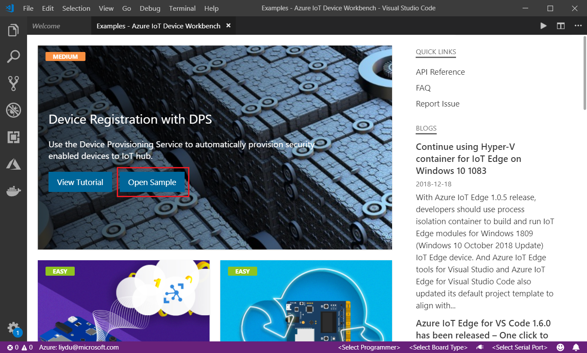

## Save a Unique Device Secret on device security storage

Auto-provisioning can be configured on a device based on the device's [attestation mechanism](https://docs.microsoft.com/en-us/azure/iot-dps/concepts-security#attestation-mechanism). The MXChip IoT DevKit uses the [Device Identity Composition Engine](https://trustedcomputinggroup.org/wp-content/uploads/Foundational-Trust-for-IOT-and-Resource-Constrained-Devices.pdf) from the [Trusted Computing Group](https://trustedcomputinggroup.org). A **Unique Device Secret** (UDS) saved in an STSAFE security chip ([STSAFE-A100](https://microsoft.github.io/azure-iot-developer-kit/docs/understand-security-chip/)) on the DevKit is used to generate the device's unique [X.509 certificate](concepts-security.md#x509-certificates). The certificate is used later for the enrollment process in the Device Provisioning service, and during registration at runtime.

A typical UDS is a 64-character string, as seen in the following sample:

```
19e25a259d0c2be03a02d416c05c48ccd0cc7d1743458aae1cb488b074993eae
```

To save a UDS on the DevKit:

1. In VS Code, click on the status bar to select the COM port for the DevKit.
  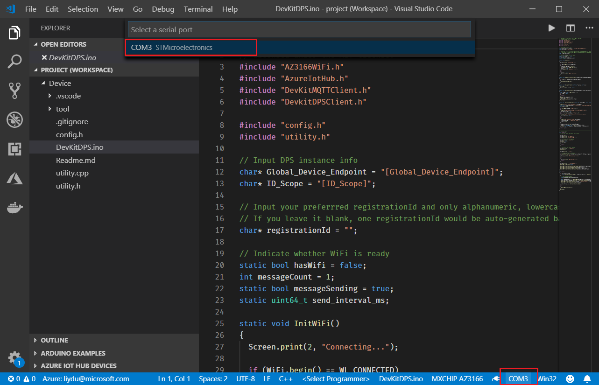

1. On DevKit, hold down **button A**, push and release the **reset** button, and then release **button A**. Your DevKit enters configuration mode.

1. Click `F1` to open the command palette, type and select **Azure IoT Device Workbench: Configure Device Settings... > Config Unique Device String (UDS)**.
  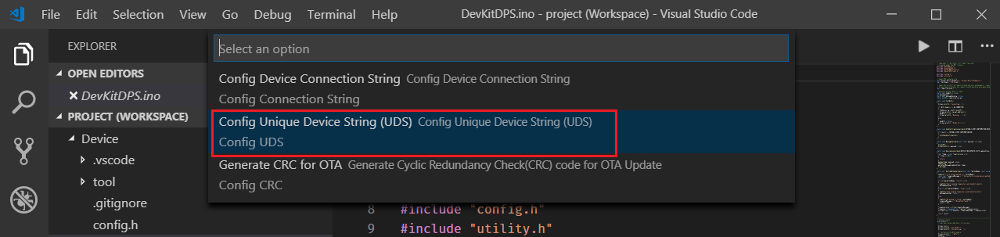

1. Note down the generated UDS string. You will need it to generate the X.509 certificate. Then press `Enter`.
  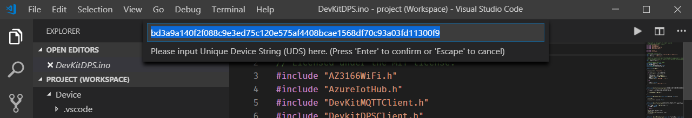

1. Confirm from the notification that UDS has been configured on the STSAFE successfully.
  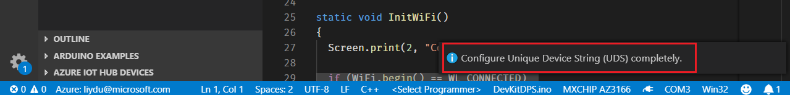

> [!NOTE]
> Alternatively, you can configure UDS via serial port by using utilities such as Putty. Follow [Use configuration mode](https://microsoft.github.io/azure-iot-developer-kit/docs/use-configuration-mode/) to do so.

## Update the Global Device Endpoint and ID Scope

In device code, you need to specify the [Device provisioning endpoint](/azure/iot-dps/concepts-service#device-provisioning-endpoint) and ID scope to ensure the tenant isolation.

1. In the Azure portal, select the **Overview** pane of your Device Provisioning service and note down the **Global device endpoint** and **ID Scope** values.
  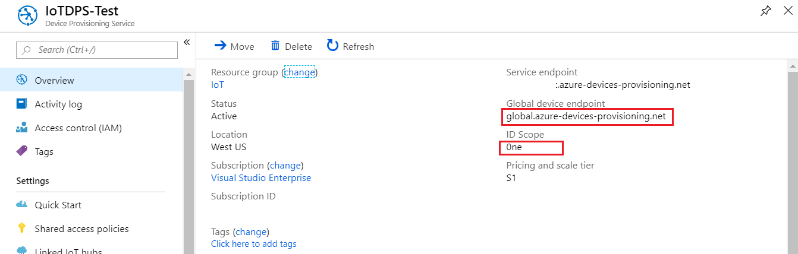

1. Open **DevKitDPS.ino**. Find and replace `[Global Device Endpoint]` and `[ID Scope]` with the values you just noted down.
  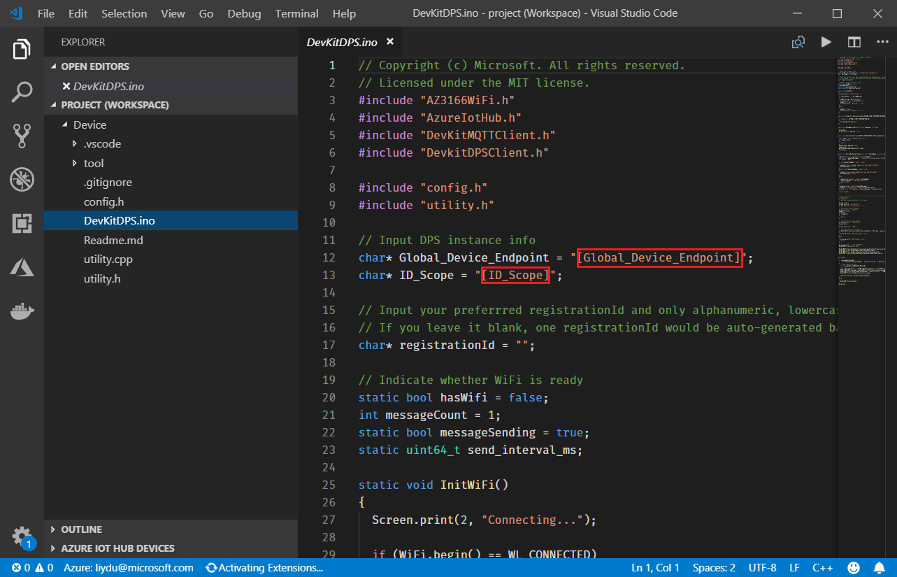

1. Fill the `registrationId` variable in the code. Only alphanumeric, lowercase, and hyphen combination with a maximum of 128 characters is allowed. Also noted down the value.
  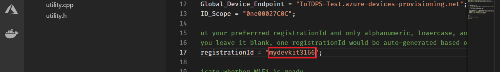

1. Click `F1`, type and select **Azure IoT Device Workbench: Upload Device Code**. It starts compiling and uploading the code to DevKit.
  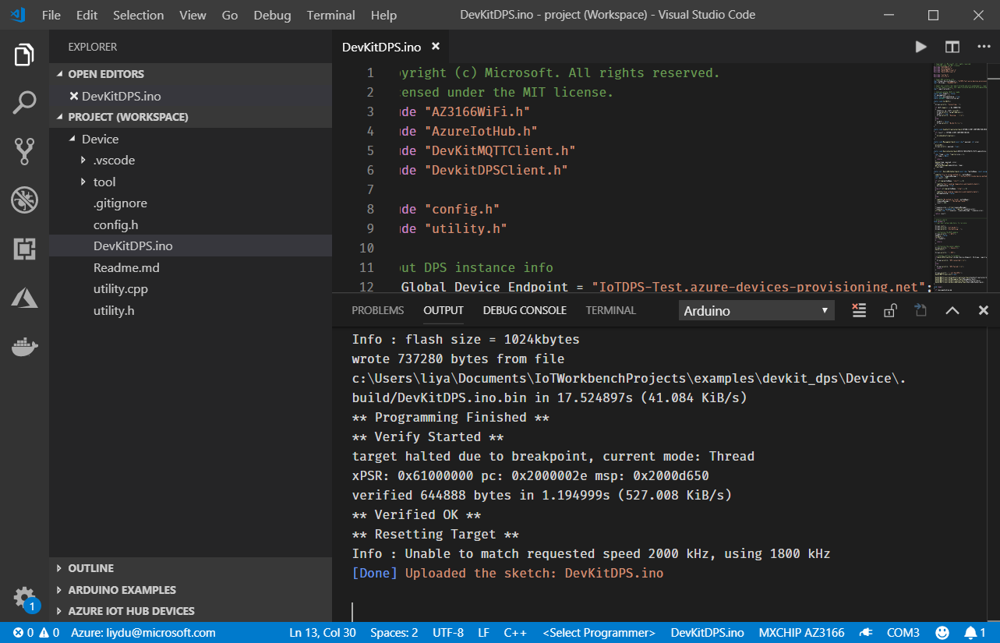

## Generate X.509 certificate

The [attestation mechanism](https://docs.microsoft.com/en-us/azure/iot-dps/concepts-security#attestation-mechanism) used by this sample is X.509 certificate. You need to use a utility to generate it.

> [!NOTE]
> The X.509 certificate generator only supports Windows now.

1. In VS Code, click `F1`, type and select **Open New Terminal** to open terminal window.

1. Run `dps_cert_gen.exe` in `tool` folder.

1. Specify the compiled binary file location as `..\.build\DevKitDPS`. Then paste the **UDS** and **registrationId** you just noted down. 
  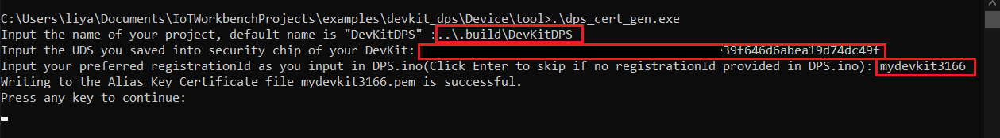

1. A `.pem` X.509 certificate generates in the same folder.
  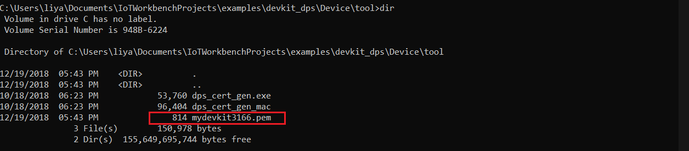

## Create a device enrollment entry

1. In the Azure portal, open your Device Provision Service, navigate to Manage enrollments section, and click **Add individual enrollment**.
  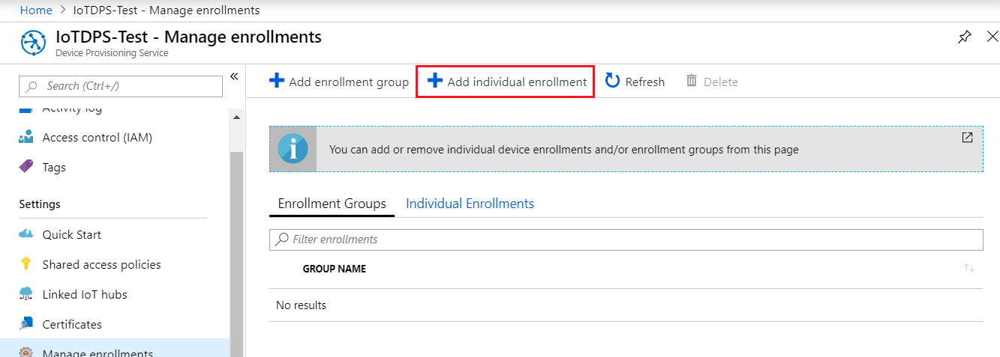

1. Click file icon next to **Primary Certificate .pem or .cer file** to upload the `.pem` file generated. Then click **Save**.
  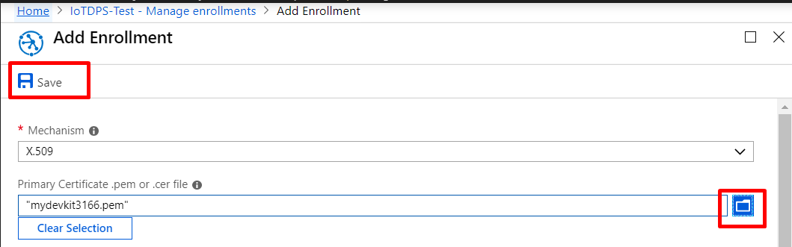

## Verify the DevKit is registered with Azure IoT Hub

Press the **Reset** button on your DevKit. You should see **DPS Connected!** on DevKit screen. After the device reboots, the following actions take place:

1. The device sends a registration request to your Device Provisioning service.
1. The Device Provisioning service sends back a registration challenge to which your device responds.
1. On successful registration, the Device Provisioning service sends the IoT Hub URI, device ID, and the encrypted key back to the device.
1. The IoT Hub client application on the device connects to your hub.
1. On successful connection to the hub, you see the device appear in the IoT Hub Device Explorer.
  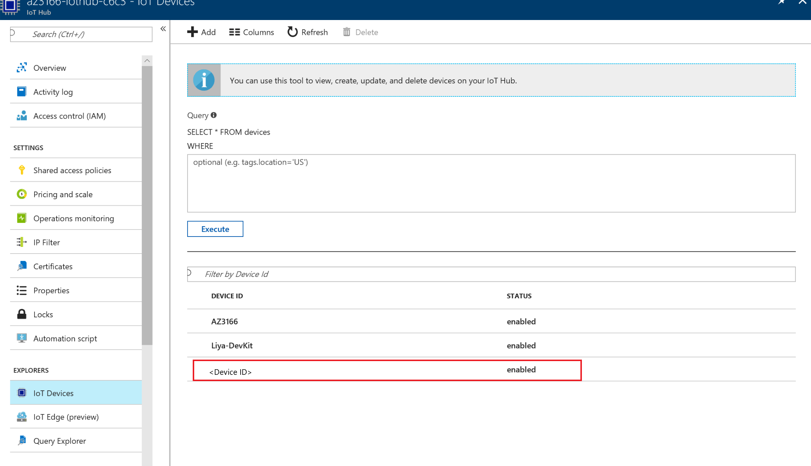

## Finished!

You have successfully set up autoprovisioning and registered a device with IoT Hub Device Provisioning Service. 


## Optional Challenger Lab: 

### Throughout the device lifecycle, there are needs at different stage for example disenroll a device, or change the certicate of a device. How to accomplish common tasks like that? 

>[!Tip]
>Device Provisioning Service provides capabilities to help manage  a device's life cycle. Take a closer look at the options available under Manage Enrollment.  

References: 
- https://docs.microsoft.com/en-us/azure/iot-dps/how-to-reprovision
- https://docs.microsoft.com/en-us/azure/iot-dps/how-to-reprovision
- https://docs.microsoft.com/en-us/azure/iot-dps/how-to-unprovision-devices
