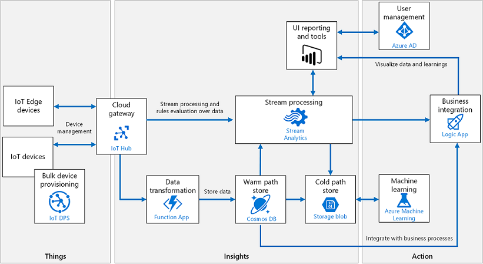

# Eco-system Bootcamp Hands on Labs

<!--  -->

## Lab 0: How to Redeem Microsoft Azure Pass

**Duration** 15 minutes 

[How to Redeem Microsoft Azure Pass](Lab0.md)

## Day 1

### Lab 1: Windows + Azure IoT Edge - Basic Lab

**Duration**: 60 minutes

[Windows + Azure IoT Edge -Basic Lab](Day1-HOL1.md)  

### Lab 2: Windows + Azure IoT Edge - Advanced Lab

**Duration**: 60 minutes

[Windows + Azure IoT Edge -Advanced Lab](Day1-HOL2.md)

### Lab 3: Windows IoT Core + IoT Edge Lab

**Duration**: 60 minutes

[Windows + Azure IoT Core + IoT Edge Lab](Day1-HOL3.md)

## Day 2

### Lab 1: Introduction to Azure IoT Hub and Connect MXChip

**Duration**: 60 minutes

[Connect to Azure IoT Hub using MXChip](Day2-HOL1.md) 

### Lab 2 : Create Azure Time Series Insights and Visualize Device Data 

**Duration**: 60 minutes

[Time Series Insights Lab](Day2-HOL2.md)

### Lab 3 : Capture Device Events and Send Notifications

**Duration**: 60 minutes

[Capture Device Events and Send Notifications](Day2-HOL3.md) 

### Lab 4: Device Provisioning Service 

**Duration**: 60 minutes

[Device Provisioning Service](Day2-HOL4.md)

## Day 3

### Lab 1 : Connect and Monitor Devices Using IoT Central  

**Duration**: 60 minutes

[Connect and Monitor Devices Using IoT Central](Day3-HOL1.md)

### Lab 2 : Intelligent Edge  

**Duration**: 90 minutes

[Connect and Monitor Devices Using IoT Central](Day3-HOL2.md)

<!-- ## Architecture Design Session

[Architecture Design Session](ADS.md) -->

## Tools and Software for Dev Environment Setup
[Tools and Software for Dev Environment Setup](Dev-Env-Setup.md)