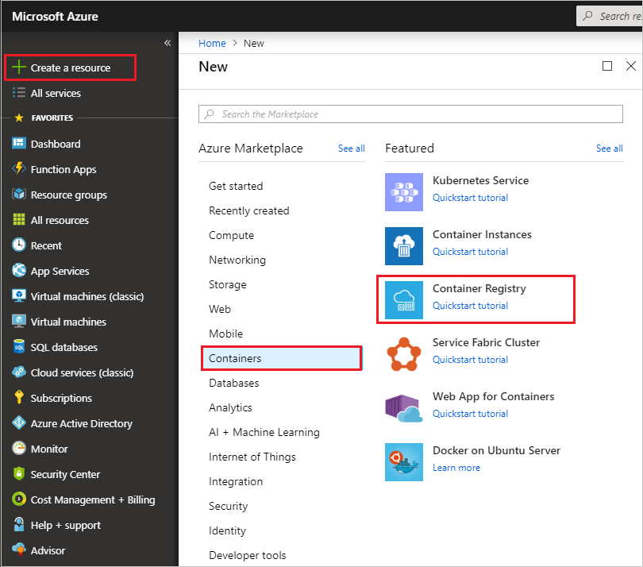
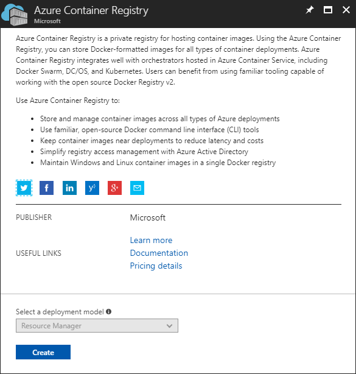
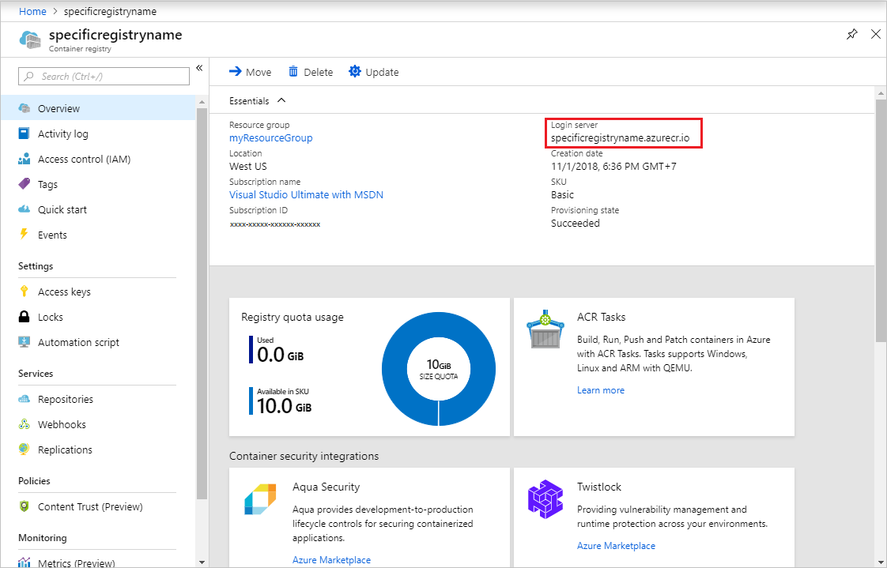

# Quickstart: Create a private container registry using the Azure portal

An Azure container registry is a private Docker registry in Azure where you can store and manage your private Docker container images. In this quickstart, you create a container registry with the Azure portal. Then, use Docker commands to push a container image into the registry, and finally pull and run the image from your registry.

To log in to the registry to work with container images, this quickstart requires that you are running the Azure CLI (version 2.0.55 or later recommended). Run `az --version` to find the version. If you need to install or upgrade, see [Install Azure CLI][azure-cli].

You must also have Docker installed locally. Docker provides packages that easily configure Docker on any [Mac][docker-mac], [Windows][docker-windows], or [Linux][docker-linux] system.

## Sign in to Azure

Sign in to the Azure portal at https://portal.azure.com.

## Create a container registry

Select **Create a resource** > **Containers** > **Container Registry**.



Enter values for **Registry name** and **Resource group**. The registry name must be unique within Azure, and contain 5-50 alphanumeric characters. For this quickstart create a new resource group in the `West US` location named `myResourceGroup`, and for **SKU**, select 'Basic'. Select **Create** to deploy the ACR instance.



In this quickstart you create a *Basic* registry, which is a cost-optimized option for developers learning about Azure Container Registry. For details on available service tiers, see [Container registry SKUs][container-registry-skus].

When the **Deployment succeeded** message appears, select the container registry in the portal. 



Take note of the value of the **Login server**. You use this value in the following steps while working with your registry with the Azure CLI and Docker.

## Log in to registry

Before pushing and pulling container images, you must log in to the ACR instance. Open a command shell in your operating system, and use the [az acr login][az-acr-login] command in the Azure CLI.

```azurecli
az acr login --name <acrName>
```

The command returns `Login Succeeded` once completed. 

[!INCLUDE [container-registry-quickstart-docker-push](../../includes/container-registry-quickstart-docker-push.md)]

## List container images

To list the images in your registry, navigate to your registry in the portal and select **Repositories**, then select the repository you created with `docker push`.

In this example, we select the **hello-world** repository, and we can see the `v1`-tagged image under **TAGS**.

![List container images in the Azure portal][qs-portal-09]

[!INCLUDE [container-registry-quickstart-docker-pull](../../includes/container-registry-quickstart-docker-pull.md)]
