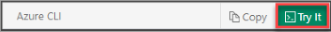

# Create an IoT hub using the Azure CLI

This article shows you how to create an IoT hub using Azure CLI.

## Prerequisites

To complete this how-to, you need an Azure subscription. If you don't have an Azure subscription, create a [free account](https://azure.microsoft.com/free/?WT.mc_id=A261C142F) before you begin.

## Open Azure Cloud Shell

Azure Cloud Shell is a free, interactive shell that you can use to run the steps in this article. Common Azure tools are preinstalled and configured in Cloud Shell for you to use with your account. Select **Copy** to copy the code, paste it in Cloud Shell, and then press Enter to run it. There are a few ways to open Cloud Shell:

|  |   |
|-----------------------------------------------|---|
| Select **Try It** in the upper-right corner of a code block. |  |
| Open Cloud Shell in your browser. | [](https://shell.azure.com/bash) |
| Select the **Cloud Shell** button on the menu in the upper-right corner of the [Azure portal](https://portal.azure.com). |	 |
|  |  |

## Sign in and set your Azure account

If you are running Azure CLI locally instead of using Cloud Shell, you need to sign in to your Azure account.

At the command prompt, run the [login command](https://docs.microsoft.com/cli/azure/get-started-with-azure-cli):

   ```azurecli
   az login
   ```

Follow the instructions to authenticate using the code and sign in to your Azure account through a web browser.

## Create an IoT Hub

Use the Azure CLI to create a resource group and then add an IoT hub.

1. When you create an IoT hub, you must create it in a resource group. Either use an existing resource group, or run the following [command to create a resource group](https://docs.microsoft.com/cli/azure/resource):

   ```azurecli
   az group create --name {your resource group name} --location westus
   ```

   > [!TIP]
   > The previous example creates the resource group in the West US location. You can view a list of available locations by running this command: 
   >
   >``` bash
   >az account list-locations -o table
   >```
   >

2. Run the following [command to create an IoT hub](https://docs.microsoft.com/cli/azure/iot/hub#az-iot-hub-create) in your resource group, using a globally unique name for your IoT hub:

   ```azurecli
   az iot hub create --name {your iot hub name} --resource-group {your resource group name} --sku S1
   ```

   > [!IMPORTANT]
   > The IoT hub will be publicly discoverable as a DNS endpoint, so make sure to avoid any sensitive information while naming it.
   >

The previous command creates an IoT hub in the S1 pricing tier for which you are billed. For more information, see [Azure IoT Hub pricing](https://azure.microsoft.com/pricing/details/iot-hub/).

